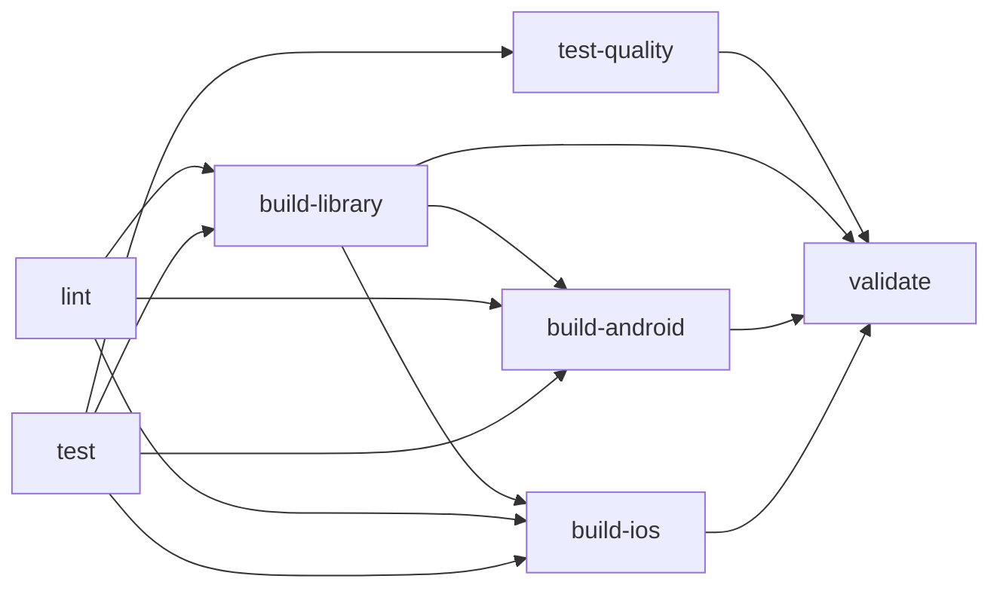

# 🛠️ Development Guide

Complete guide for developing and maintaining the Bearound React Native SDK.

## 📋 Table of Contents

- [Project Structure](#project-structure)
- [Development Setup](#development-setup)
- [Testing Strategy](#testing-strategy)
- [CI/CD Pipeline](#cicd-pipeline)
- [Release Process](#release-process)
- [Code Quality](#code-quality)

## 🏗️ Project Structure

```
bearound-react-native-sdk/
├── src/                          # Source code
│   ├── __tests__/               # Test files
│   │   ├── basic.test.ts        # Comprehensive test suite
│   │   └── README.md            # Testing documentation
│   ├── index.tsx                # Main SDK entry point
│   ├── permissions.ts           # Permission management
│   └── NativeBearoundReactSdk.ts # TurboModule interface
├── android/                     # Android native code
├── ios/                         # iOS native code
├── example/                     # Example React Native app
├── scripts/                     # Development scripts
│   └── release-check.sh         # Release readiness checker
├── .github/                     # GitHub workflows and docs
│   ├── workflows/
│   │   ├── ci.yml              # Continuous Integration
│   │   ├── cd.yml              # Continuous Deployment
│   │   └── cd-test.yml         # CD pipeline testing
│   ├── actions/setup/          # Reusable GitHub Actions
│   ├── CD_SETUP.md             # CD configuration guide
│   └── environments/           # Environment configurations
└── jest.config.js              # Testing configuration
```

## 🚀 Development Setup

### Prerequisites

- Node.js ≥ 18
- Yarn ≥ 3.6
- React Native CLI
- Android Studio (for Android development)
- Xcode (for iOS development)

### Initial Setup

1. **Clone and Install:**
   ```bash
   git clone <repository-url>
   cd bearound-react-native-sdk
   yarn install
   ```

2. **Build SDK:**
   ```bash
   yarn prepare
   ```

3. **Run Example App:**
   ```bash
   # Android
   yarn example android
   
   # iOS
   yarn example ios
   ```

### Development Workflow

1. **Make Changes** to SDK source code in `src/`
2. **Run Tests** to ensure quality:
   ```bash
   npm test
   npm run lint
   npm run typecheck
   ```
3. **Test in Example App** to validate functionality
4. **Commit** using conventional commit format
5. **Push** to feature branch and create PR

## 🧪 Testing Strategy

### Test Architecture

Our testing strategy focuses on **functional testing** rather than complex mocking:

- ✅ **API Contract Testing** - Validates public interfaces
- ✅ **Cross-platform Testing** - Android vs iOS behavior
- ✅ **Permission Flow Testing** - Core SDK functionality
- ✅ **Type Safety Testing** - TypeScript compliance
- ❌ **Unit Testing** - Avoided due to heavy native dependencies

### Test Coverage

| Metric     | Target | Current |
|------------|--------|---------|
| Lines      | 80%    | 85.71%  |
| Statements | 75%    | 81.81%  |
| Functions  | 70%    | 75%     |
| Branches   | 50%    | 53.06%  |

### Running Tests

```bash
# Standard test run
npm test

# With coverage report
npm test -- --coverage

# Watch mode for development
npm test -- --watch

# Verbose output for debugging
npm test -- --verbose
```

## 🔄 CI/CD Pipeline

### Continuous Integration (CI)

**Triggers:** Every push to `main` and `develop` branches

**Jobs:**
1. **lint** - ESLint and TypeScript checking
2. **test** - Jest test suite with coverage
3. **test-quality** - Test structure validation
4. **build-library** - SDK package build
5. **build-android** - Android example build
6. **build-ios** - iOS example build
7. **validate** - Final success confirmation

**Dependencies:**


### Continuous Deployment (CD)

**Triggers:** Push to `main` branch OR manual workflow dispatch

**Flow:**
1. **Wait for CI** to complete successfully
2. **Check Release Need** based on commit messages
3. **Bump Version** in package.json
4. **Create Git Tag** and push to repository
5. **Build Package** for distribution
6. **Generate Changelog** from git history
7. **Create GitHub Release** with notes
8. **Publish to NPM** with access controls

**Release Detection:**
- `fix:`, `perf:` → Patch release (1.0.0 → 1.0.1)
- `feat:` → Minor release (1.0.0 → 1.1.0)
- `BREAKING CHANGE:` → Major release (1.0.0 → 2.0.0)

## 📦 Release Process

### Automatic Releases (Recommended)

1. **Develop** features in feature branches
2. **Create PR** to `develop` branch
3. **Merge PR** after review and CI success
4. **Create PR** from `develop` to `main`
5. **Merge to main** - CD automatically handles release

### Manual Releases

Use GitHub Actions manual trigger:
1. Go to **Actions > CD (Release & Deploy)**
2. Click **Run workflow**
3. Select release type (patch/minor/major/prerelease)

### Release Readiness Check

Before merging to main:
```bash
npm run release:check
```

This script analyzes:
- Current branch (should be main)
- Uncommitted changes
- Commits since last release
- Suggested release type
- Version calculations

### Post-Release Verification

After CD completes:
- ✅ New tag created: `v1.x.x`
- ✅ GitHub release published
- ✅ NPM package updated
- ✅ Version bumped in package.json

## 📊 Code Quality

### Quality Gates

**Pre-commit:**
- ESLint with Prettier formatting
- TypeScript compilation
- No console.log statements (in production code)

**CI Requirements:**
- All tests pass
- Coverage thresholds met
- No linting errors
- TypeScript compilation success
- Successful builds for Android and iOS

**CD Requirements:**
- CI pipeline success
- Main branch only
- Valid commit message format
- No conflicts or reverts

### Code Standards

**File Organization:**
- One main export per file
- Clear separation of concerns
- Platform-specific code clearly marked
- Comprehensive JSDoc documentation

**TypeScript:**
- Strict mode enabled
- Explicit return types for public APIs
- No `any` types (use `unknown` if necessary)
- Proper generic constraints

**React Native:**
- Cross-platform compatibility first
- Platform checks for specific behavior
- TurboModule architecture for native interfaces
- Proper error handling for native calls

### Documentation Requirements

Every public API must have:
- JSDoc comments with examples
- Platform-specific behavior notes
- Parameter and return type documentation
- Usage examples in documentation

## 🔧 Maintenance

### Regular Tasks

**Weekly:**
- Review and merge dependency updates
- Check CI/CD pipeline health
- Review open issues and PRs

**Monthly:**
- Update GitHub Actions versions
- Review and rotate NPM tokens
- Security audit of dependencies

**Quarterly:**
- Performance review of CI/CD pipeline
- Update development tools and configs
- Review and update documentation

### Troubleshooting

**Common Issues:**

1. **Tests failing locally but passing in CI:**
   - Check Node.js version consistency
   - Clear Jest cache: `npx jest --clearCache`
   - Verify environment variables

2. **CD not triggering:**
   - Ensure on main branch
   - Check CI completed successfully
   - Verify commit message format

3. **NPM publish failures:**
   - Check NPM_TOKEN secret
   - Verify package.json publishConfig
   - Ensure version doesn't already exist

**Debug Commands:**
```bash
# Clear all caches
yarn clean
rm -rf node_modules yarn.lock
yarn install

# Debug Jest issues
npx jest --detectOpenHandles --verbose

# Test CD pipeline
npm run release:check
```

## 🤝 Contributing

1. Fork the repository
2. Create feature branch: `git checkout -b feature/amazing-feature`
3. Make changes with proper commit messages
4. Add tests for new functionality
5. Ensure all quality gates pass
6. Submit PR to `develop` branch

**Commit Message Format:**
```
type(scope): description

[optional body]

[optional footer]
```

Types: `feat`, `fix`, `docs`, `style`, `refactor`, `perf`, `test`, `chore`

---

This guide ensures consistent, high-quality development practices for the Bearound React Native SDK. For questions or improvements, please open an issue or submit a PR.